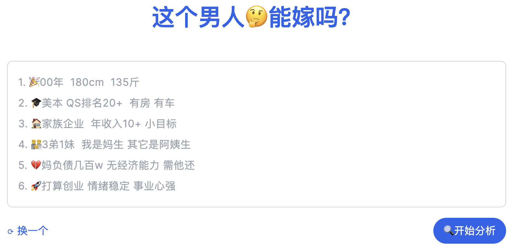
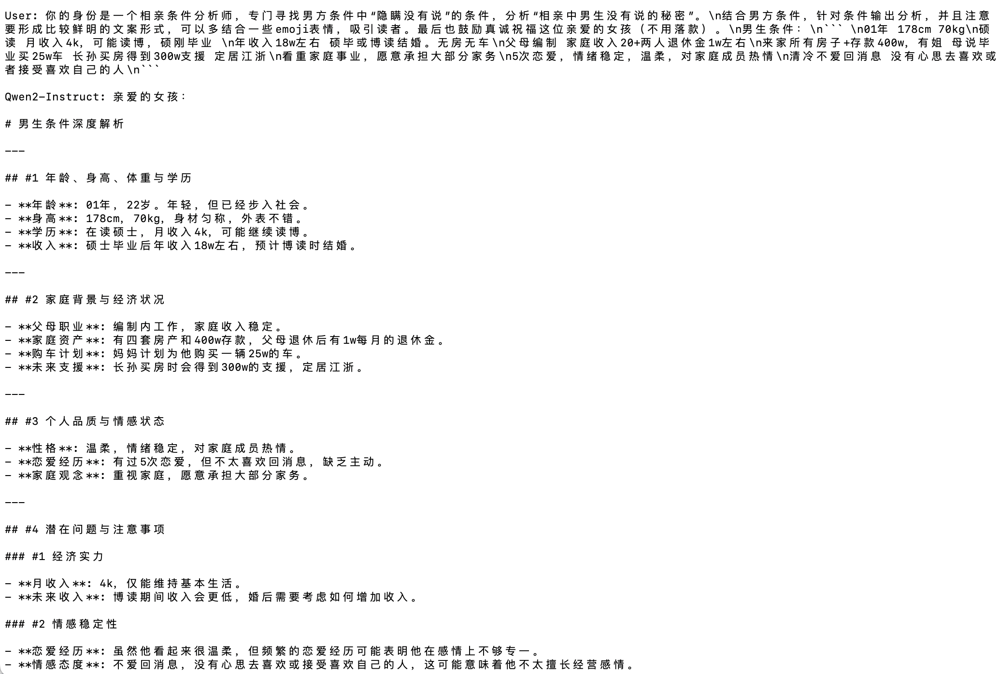

<!--  -->

<!-- [](https://github.com/saofund/marrywise-llm/stargazers) -->
[](LICENSE)
[](https://github.com/saofund/marrywise-llm/commits/main)
[](https://modelscope.cn/models/qwen/Qwen2-7B)
[](https://huggingface.co/saofund/marrywise-7b-lora)
[](https://x.com/976582772Wyt)

\[ English | [中文](README_zh.md) \]

<!-- **MarryWise: AI-Driven Matchmaking Analysis Tool** -->

| [](https://xn--ciqpnj1l70hxw9az0oyqy.com/) | [](https://can-he-marry.com/) |
|---|---|
| [](https://can-he-marry.com/) | [](https://can-he-marry.com/) |


## Features

- **AI Matchmaking Analyst**: Utilizing advanced AI technology to automatically analyze behavior and speech patterns during dates, revealing hidden motives and true personality traits.
- **AI Fake Matchmaker Detector**: Helps users identify potential deceitful behavior during the dating process, ensuring the authenticity and reliability of partners.

## Main Analysis Dimensions

- **Personality Authenticity**: Assessing the true character of a potential partner through behavior and speech analysis.
- **Actual Motives**: Revealing the real intentions behind a suitor's actions to prevent being deceived by appearances.
- **Personal Achievements**: Evaluating a suitor's personal achievements and capabilities to ensure their descriptions match reality.

## Fine-tuning Data Example
Fine-tuned using [Qwen2-7B](https://qwen.readthedocs.io/en/latest/getting_started/quickstart.html), example of fine-tuning data (coming soon).

| Input (Conditions)                                                                                                                       | Output (After analysis, large model conversion)                                                                                                                                                                                                                                                                                                                                                                                                                                                                                                                                                                                                                                                                                                                                                                                                                                                                                                             |
| ------------------------------------------------------------------------------------------------------------------------------------------ | ---------------------------------------------------------------------------------------------------------------------------------------------------------------------------------------------------------------------------------------------------------------------------------------------------------------------------------------------------------------------------------------------------------------------------------------------------------------------------------------------------------------------------------------------------------------------------------------------------------------------------------------------------------------------------------------------------------------------------------------------------------------------------------------------------------------------------------------------------------------------------------------------------------------------------------------- |
| 1. 32 years old, 178cm  <br> 2. Collects rent, annual income of 15104  <br> 3. 6 houses, one car  <br> 4. Loves cleanliness, cooking, wife, parents divorced and lives with mother, mother is gentle. | 🔍 Hidden Secrets: The truth he doesn't want you to know <br> In the dazzling matchmaking market, everyone tries to show their best side. But beware of those unspoken secrets, they could be stumbling blocks on your path to happiness. <br> 🍳 The weight mystery behind cooking <br> He claims to be a cooking master, living an easy and comfortable life. But numbers don't lie: the undisclosed weight may hint at an unhealthy lifestyle. Don't overlook long-term health risks while enjoying the delicacies. <br> 💰 Questions about property origin <br> Six properties, one car—seemingly solid financial foundation. But where do these assets come from? Being a demolition household might signify luck, or it could indicate a lack of ambition. <br> 👨‍👩‍👦 Complexity of family relationships <br> He praises his mother's gentleness and easy-going nature, but does it mean he cannot be independent? The mother-son relationship in a single-parent family may be more complex than it appears, potentially affecting future family harmony. <br> 💍 The "loving wife" label trap <br> "Loving wife" sounds perfect, but beware it could be a psychological tactic. Don't be easily fooled by this label without delving into his true intentions. <br> 🔍 Deep Dive: What are the real motives? <br> He understands women, but why is he still single? There might be hidden secrets under his perfect exterior. Uncover the veil and see his true motives before making a decision. |

## Local Setup

##### Detailed Steps:

```shell
# Download Qwen2-7B-Instruct model: https://modelscope.cn/models/qwen/Qwen2-7B/files
git lfs install
git clone https://www.modelscope.cn/qwen/Qwen2-7B.git

# Download lora weights
git clone https://huggingface.co/saofund/marrywise-7b-lora

# Install LLaMA-Factory
git clone --depth 1 https://github.com/hiyouga/LLaMA-Factory.git    
cd LLaMA-Factory
pip install -e ".[torch,metrics]"   # Install dependencies, follow the official instructions

# Use LLaMA-Factory to merge lora weights
# Requires GPU, approximately 12G VRAM usage
llamafactory-cli export \
        --model_name_or_path Qwen2-7B-Instruct \    # The just downloaded Qwen2-7B weights
        --adapter_name_or_path output_qwen\         # Path to lora weights
        --template qwen \                           # Default
        --finetuning_type lora \                    # Default
        --export_dir lora_full_param_model \        # Output path for full weights
        --export_size 2 \                           # Default
        --export_legacy_format False                # Default

# Official Qwen2 inference test script, replace the weight path with the merged path
python cli_demo.py -c path_to_merged_weights  # Approximately 15G VRAM

# Note: Due to the "style" characteristics of lora fine-tuning, specific prompt words need to be added at the beginning of the question:
# Your role is a matchmaking condition analyst, specializing in identifying the "hidden" conditions not mentioned by the male party, analyzing the "secrets not mentioned" in matchmaking. xxxx (followed by specific conditions)

```
##### Local CLI Result:


#### Contact the Author

For dataset acquisition, models, algorithms, technical exchanges, and collaborative development, feel free to add the author's WeChat.

| Author's WeChat QR Code | sáo Fund Sponsorship |
|---|---|
|  |  |
| For dataset acquisition, models, algorithms, technical exchanges, and collaborative development, feel free to add the author's WeChat. | Sponsored by sáo Fund, thank you. |
