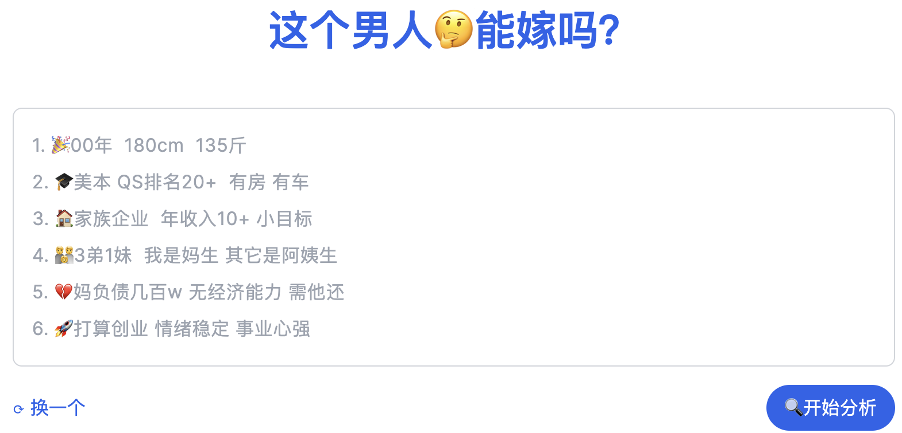
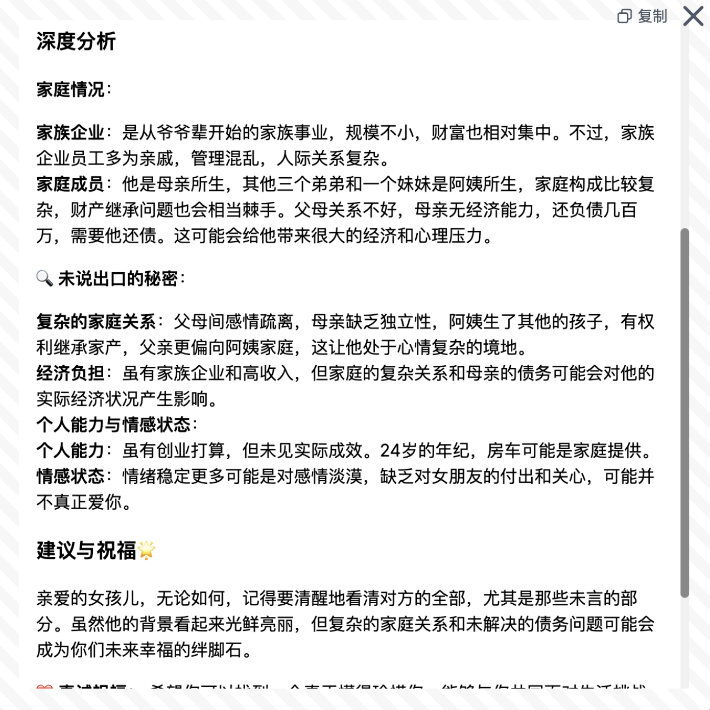
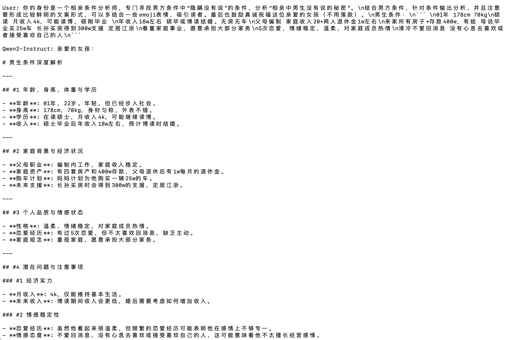

<!--  -->

<!-- [](https://github.com/saofund/marrywise-llm/stargazers) -->
[](LICENSE)
[](https://github.com/saofund/marrywise-llm/commits/main)
[](https://modelscope.cn/models/qwen/Qwen2-7B)
[](https://huggingface.co/saofund/marrywise-7b-lora)
[](https://x.com/976582772Wyt)

\[ English | [中文](README_zh.md) \]

<!-- **MarryWise: AI驱动的相亲分析工具** -->


| [](https://xn--ciqpnj1l70hxw9az0oyqy.com/) | [](https://can-he-marry.com/) |
|---|---|
| [](https://can-he-marry.com/) | [](https://can-he-marry.com/) |


## 功能特点

- **AI 相亲分析师**：利用先进的 AI 技术，自动分析约会中的行为和言语模式，揭示隐藏的动机和真实的性格特征。
- **AI 打假媒婆**：帮助用户识别约会过程中的潜在欺骗行为，确保伴侣的真实性和可靠性。

## 主要分析维度

- **性格真实性**：通过行为和言语分析，评估潜在伴侣的真实性格。
- **实际动机**：揭示求婚者行为背后的真实意图，防止被表象所迷惑。
- **个人成就**：评估求婚者的个人成就和能力，确保其描述与实际情况一致。


## 微调数据示例
使用 [Qwen2-7B](https://qwen.readthedocs.io/en/latest/getting_started/quickstart.html) 微调，微调数据示例（即将开源）。


| 输入（条件）                                                                                                                     | 输出：（分析、大模型转换后）                                                                                                                                                                                                                                                                                                                                                                                                                                                                                                                                                                                                                                                                                                                                                                                                                                                                                                             |
| -------------------------------------------------------------------------------------------------------------------------------- | ---------------------------------------------------------------------------------------------------------------------------------------------------------------------------------------------------------------------------------------------------------------------------------------------------------------------------------------------------------------------------------------------------------------------------------------------------------------------------------------------------------------------------------------------------------------------------------------------------------------------------------------------------------------------------------------------------------------------------------------------------------------------------------------------------------------------------------------------------------------------------------------------------------------------------------------- |
| 1. 32岁，178  <br> 2. 收房租，年收入15104  <br> 3. 6套房，一辆代步车  <br> 4. 爱干净，爱做饭，爱老婆，父母离异跟母亲，母亲温柔。 | 🔍 隐藏的秘密：他不想让你知道的真相 <br> 在闪耀的相亲市场，每个人都试图展示自己最好的一面。但小心那些未被言说的秘密，它们可能是你幸福之路上的绊脚石。 <br> 🍳 烹饪背后的体重迷思 <br> 他自称烹饪大师，生活轻松自在。但数字不会说谎：未提及的体重可能暗示着不健康的生活方式。在你品尝美食的同时，不要忽视长期健康的风险。 <br> 💰 财产来源的疑问 <br> 六套房产，一辆车——看似稳固的经济基础。但这些财产来自何方？拆迁户的身份可能是幸运的象征，也可能是缺乏进取心的标志。 <br> 👨‍👩‍👦 家庭关系的复杂性 <br> 他称赞母亲的温柔和易相处，但这是否意味着他无法独立？单亲家庭背景下的母子关系可能比表面看起来要复杂得多，这可能会影响未来的家庭和谐。 <br> 💍 “爱妻”标签的陷阱 <br> “爱老婆”听起来很完美，但小心这是一种心理战术。在深入了解他的真实意图之前，不要轻易被这个标签迷惑。 <br> 🔍 深入挖掘：真正的动机是什么？ <br> 他了解女性，但为何仍单身？在他的完美外表下，可能隐藏着不为人知的秘密。在做出决定之前，请揭开那层薄纱，看清他的真实动机。 |


## 本地启动

##### 详细步骤：

```shell
# 下载Qwen2-7B-Instruct模型：https://modelscope.cn/models/qwen/Qwen2-7B/files
git lfs install
git clone https://www.modelscope.cn/qwen/Qwen2-7B.git

# 下载lora权重

# 安装 LLaMA-Factory
git clone --depth 1 https://github.com/hiyouga/LLaMA-Factory.git    
cd LLaMA-Factory
pip install -e ".[torch,metrics]"   # 安装依赖，这里最好按官方乖乖装完

# 使用LLaMA-Factory 合并lora权重
# 需要GPU，大概12G显存占用
llamafactory-cli export \
        --model_name_or_path Qwen2-7B-Instruct \    # 刚下载的Qwen2-7B权重
        --adapter_name_or_path output_qwen\         # lora权重路径
        --template qwen \                           # 默认
        --finetuning_type lora \                    # 默认
        --export_dir lora_full_param_model \        # 完整权重的输出路径
        --export_size 2 \                           # 默认
        --export_legacy_format False                # 默认

# Qwen2的官方推理测试脚本，替换权重路径为刚才的合并后的路径
python cli_demo.py -c 合并后的权重路径  # 大概15G显存

# 请注意，由于lora微调的“风格”特性，需要在问题的开头加入特定提示词：
# 你的身份是一个相亲条件分析师，专门寻找男方条件中“隐瞒没有说”的条件，分析“相亲中男生没有说的秘密”。xxxx（后面跟具体条件）

```


##### 本地运行cli结果：



#### 欢迎联系作者

数据集获取、模型、算法、技术交流、合作开发等，欢迎添加作者微信。

| 作者微信二维码 | sáo基金赞助 |
|---|---|
|  |  |
| 数据集获取、模型、算法、技术交流、合作开发等，欢迎添加作者微信。 | 由 sáo 基金赞助，感谢。 |
